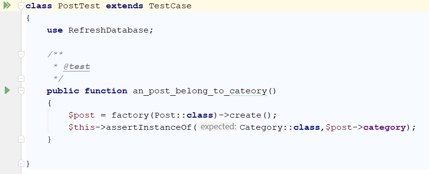
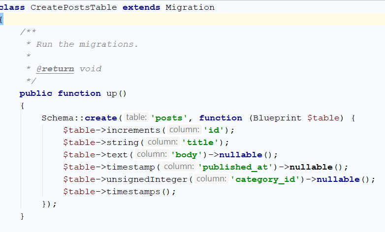
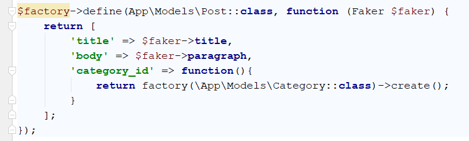
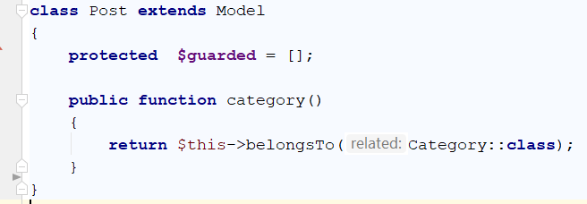
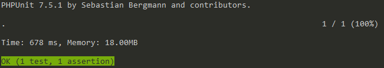
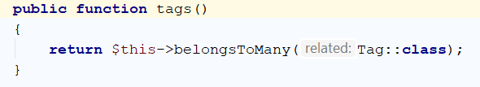
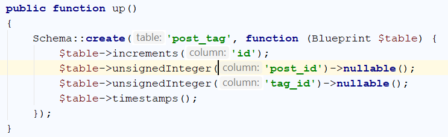
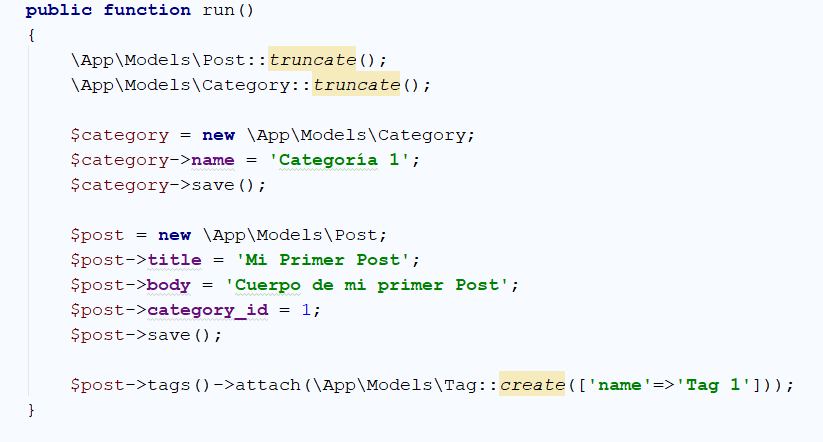

<p></p>
<p align="center"></p>

## About Laravel Models

Laravel Models es un proyecto en donde se testean las relaciones entre modelos 
ocupando eloquent y PHPUnit.


Descarga desde:

```sh
$ git clone https://github.com/nmardones/laravel-models.git
```


Hay dos ejemplos:


|  | Ejemplos |
| ------ | ------ |
| 1.- | Relaciones de modelo de un Blog |
| 2.- | Relación de un modelo de un Estado de una publicación y sus comentarios |


## 1.- Modelo de un Blog

Lista todas las opciones de php artisan.
```sh
$ php artisan list
```

Para crear modelos con php artisan se tiene la opción -h para saber las opciones que nos permite artisan.
 
```sh
$ php atisan make:model -h

$ php artisan make:model Models/Post -mfcr
```

Para mantener la misma estructura de carpetas en los test y la opcción --unit
```sh
$ php artisan make:test Models/PostTest --unit
```
 


Creamos los campos.



Creamos factory



Creamos modelo Category
```sh
$ php artisan make:model Models/Category -mfcr
```

En el modelo Post creamos la relación entre Post y Category



Ejcutamos la migraión
```sh
$ php artisan migrate:fresh
```
Ejecutamos PHPUnit

```sh
$ vendor/bin/phpunit --filter an_post_belong_to_cateory
```

en windows

```sh
$  vendor\bin\phpunit.bat --filter an_post_belong_to_cateory
```



Creamos modelo Tag

```sh
$ php artisan make:model Models/Tag -mfcr
```

Creamos la relación en Modelo Post



Creamos una migración post_tag
```sh
$ php artisan make:migration create_post_tag_table 
```
Creamos los campos de la tabla



Creamos un seed



Ejecutamos la migración
```sh
$ php artisan migrate:fresh --seed 
```
